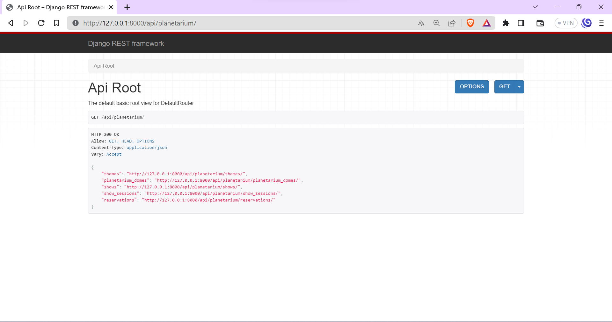
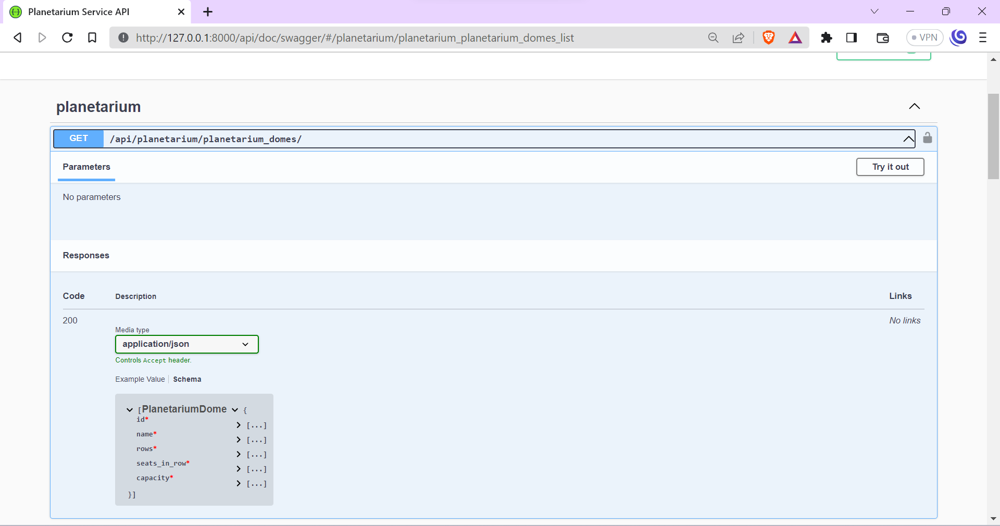

# Planetarium Service Api
Django REST framework project for managing your planetarium.

## Installing
```shell
git clone https://github.com/chipapapo/planetarium-service-api.git
cd planetarium-service-api
python4 -m venv venv
source venv/bin/activate
```
```shell
pip install -r requirements.txt
python manage.py migrate
python manage.py runserver
```
or (docker)
```shell
docker-compose up --build
```

## Models
- ShowTheme: Represent themes for astronomy shows.
- AstronomyShow: Describe astronomy shows with titles, descriptions, themes, and optional images.
- PlanetariumDome: Define planetarium domes with names, rows, and seats in each row.
- ShowSession: Represent specific sessions of astronomy shows in planetarium domes, with datetimes.
- Reservation: Manage reservations made by users for tickets.
- Ticket: Represent tickets for show sessions with row and seat information.

## Image Upload
- Allow users to upload images for AstronomyShow using the "upload_image" endpoint.

## Serializers
- Serialize model data for ShowTheme, PlanetariumDome, AstronomyShow, ShowSession, Ticket, and Reservation.
- Provide detailed serializers for different use cases.
- Validate ticket row and seat numbers before saving.

## Views and ViewSets
- Offer ViewSets for ShowTheme, PlanetariumDome, AstronomyShow, ShowSession, and Reservation models.
- Provide endpoints for creating, listing, and retrieving objects.
- Support filtering and searching for AstronomyShow and ShowSession.
- Allow image upload for AstronomyShow.

## Authentication and User Management
- Utilize JWT authentication for user login and management.
- Allow user registration and profile update.

## Permissions
- Implement custom permission to allow read-only access for authenticated users and full access for admin users.

## Pagination
- Apply custom pagination for reservations to control the number of items per page.

## Search and Filter
- Enable filtering by title and themes for AstronomyShow.
- Support filtering by show and date for ShowSession.

The Planetarium API offers a comprehensive solution for managing astronomy shows, show sessions, reservations, and user authentication. With its flexible filtering, pagination, and permission settings, it ensures efficient data management and access control.

# Interface

